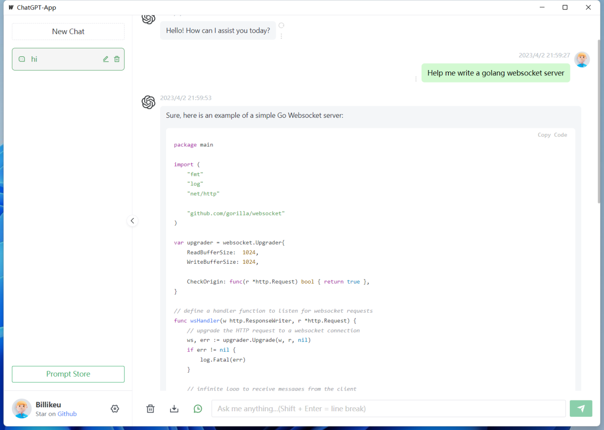
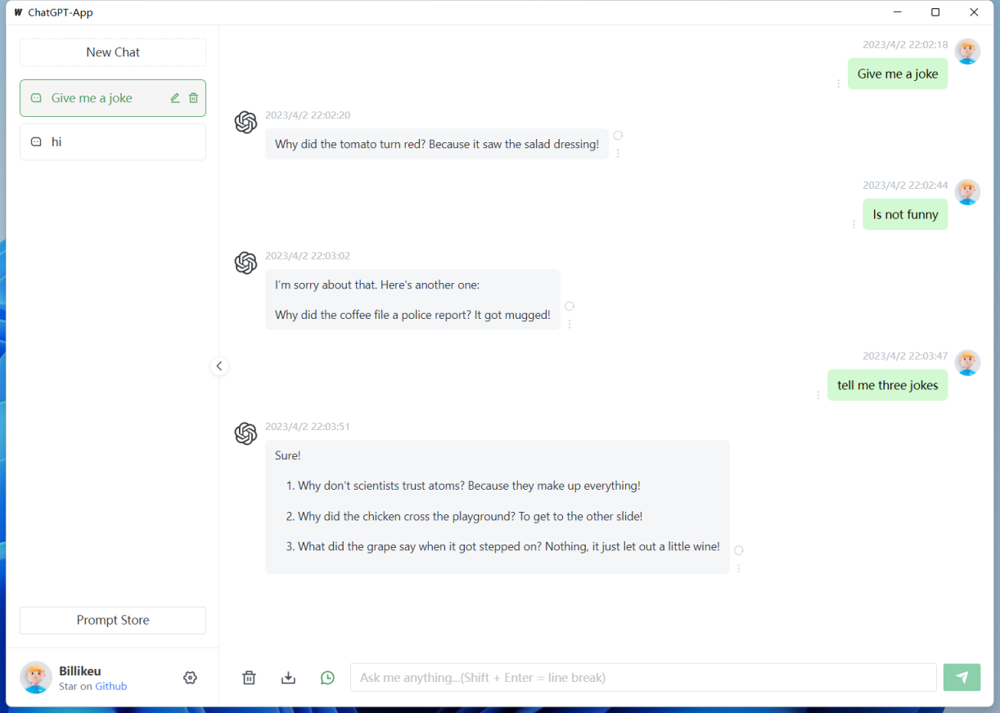
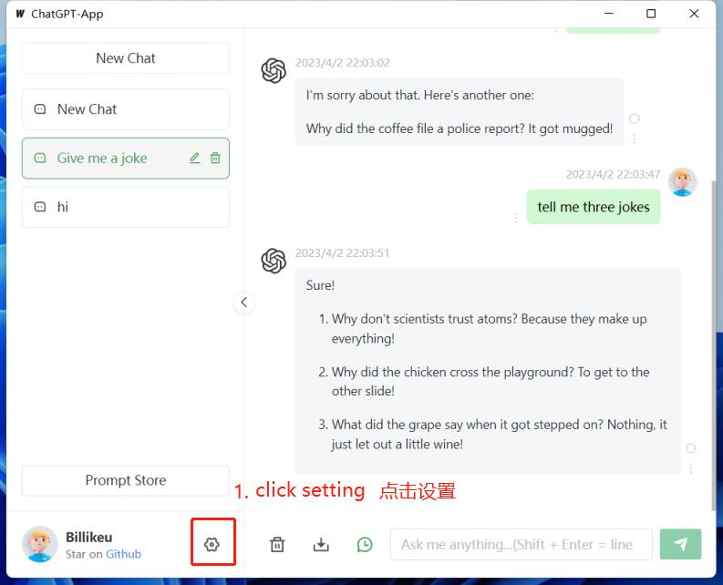
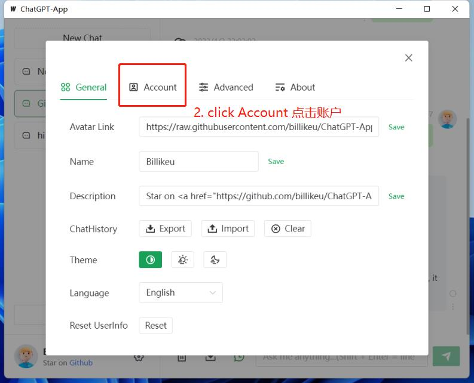
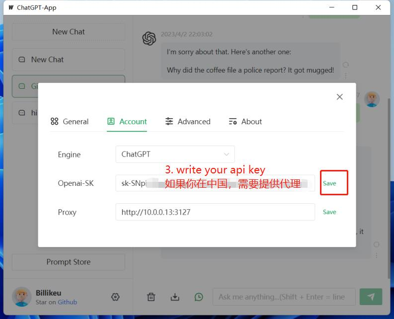

# billikeu/ChatGPT-App

Only 5.1MB, [ChatGPT-App](https://github.com/billikeu/ChatGPT-App) is a desktop chatbot application. Support multiple chat engines including `ChatGPT`, `New Bing`,`Bard`, `yiyan`, etc.

## Plan

- [x] ChatGPT
- [ ] ChatGPT Unofficial
- [x] Bing Unofficial
- [ ] Bard
- [ ] YiYan

## Support Platform

- [x] Windows
- [x] Linux
- [x] MacOs

> Disclaimer: This project is only released on GitHub, under the MIT License, free and for open-source learning purposes.

## Usage

how to use it

Click this [Release](https://github.com/billikeu/ChatGPT-App/releases) to download, of course you can also compile it yourself

1. first, click setting

2. click account setting

3. fill in your key

Now, return to use

## Building

To build a redistributable, production mode package, use `wails build`.

## References

- https://github.com/Chanzhaoyu/chatgpt-web
- https://github.com/billikeu/Go-EdgeGPT
- https://github.com/sashabaranov/go-openai
- https://github.com/gin-gonic/gin
- https://github.com/wailsapp/wails
- https://github.com/transitive-bullshit/chatgpt-api